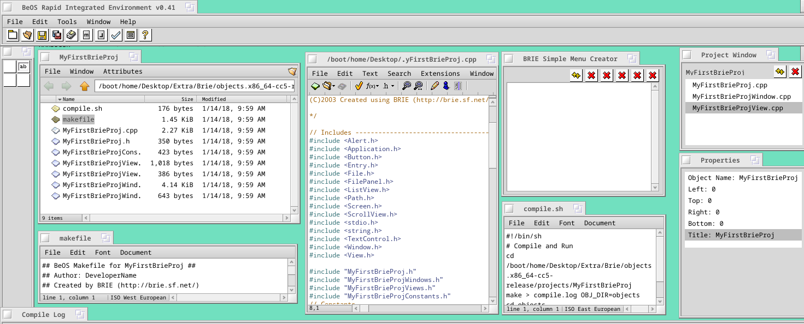

Brie
====

**BeOS Rapid Integrated Environment** is an IDE for rapid development of Haiku / BeOS / OBOS / Zeta applications. 

All code is generated in C/C++ using the BeOS API plus a few extensions.
